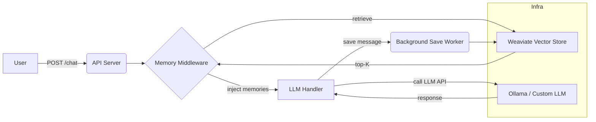

# MemCortex

**Persistent Memory Layer for LLMs (Memory-RAG)**

MemCortex is a Proof of Concept (PoC) designed to equip conversational agents and LLM applications with persistent, long-term memory. By implementing a Memory-RAG (Retrieval-Augmented Generation) architecture, MemCortex allows agents to transcend context-window limitations, enabling them to recall past interactions and specific data points indefinitely.

---

## Contents

* README (this file)
* Architectural diagram (Mermaid + ASCII)
* Package structure
* How to start

---

## Project Overview

MemCortex stores user/application memories as both text and vectors in Weaviate and exposes a memory manager + middleware that:

1. Embeds incoming text using `text-embedding-3-small` embeddings.
2. Stores memories in a `Memory_idx` class on Weaviate.
3. Runs vector searches to retrieve top‑K relevant memories for a user.
4. Injects retrieved memories into the prompt before it reaches the LLM.
5. Optionally persists new memories asynchronously.

This pattern is ideal for building chatbots, agents, and personalization layers that must "remember" details across sessions.


---

## Architecture (Mermaid)



### ASCII Diagram

```
User -> API Server (/chat)
      -> Memory Middleware:
           - Embed user query via Ollama
           - Query Weaviate vector index (top-K)
           - Re-rank / filter / format
           - Inject into prompt
      -> LLM Handler -> Local or remote LLM
      -> Return response
Background worker: saves new user messages into Weaviate (embedding -> object)
```

---

## Quickstart (developer)

Prereqs:

* Go 1.20+
* Docker & Docker Compose

1. Copy repo and set module path (or `go mod init github.com/yourname/memcortex`).
2. Create `.env` (see `.env.example`).
3. Build docker image & run server:

```bash
docker-compose up -d --build
```


5. Example request:

```bash
curl -X POST http://localhost:8080/chat \
  -H "Content-Type: application/json" \
  -H "X-User-ID: memcortex-user-x" \
  -d '{"message":"I need to go to the mall sometimes next week. I was at Shoprite last week."}'
```

The first request will save the memory asynchronously. Later requests will retrieve and inject the memory.

---

## Package structure

```
memcortex/
├─ cmd/server/main.go          # App entry point
├─ internal/
│  ├─ embedder/
│  │  └─ ollama.go             # Contains OpenAI Embedder Logic (for text-embedding-3-small)
│  ├─ handlers/
│  │  └─ chat.go               # Chat endpoint handler
│  ├─ memory/
│  │  ├─ manager.go            # High-level RAG orchestration
│  │  ├─ queue.go              
│  │  └─ store.go              # Weaviate storage wrapper
│  └─ middleware/
│     └─ memory_middleware.go  # Context injection middleware
├─ .env.example                      # Environment file
├─ docker-compose.yml
├─ Dockerfile
├─ Dockerfile.ollama
├─ go.mod
├─ go.sum
└─ README.md
```
---

### .env.example

```
EMBEDDING_MODEL=nomic-embed-text
EMBEDDING_DIM=768
SERVER_ADDR=:8080
OLLAMA_ADDR=11434
MAX_MEMORY_DISTANCE=0.5 // This describes the vector search distance 
TOP_K_MEMORIES=10
```

---

### docker-compose.yml

```yaml
services:
  ollama:
    build:
      context: .
      dockerfile: Dockerfile.ollama
    container_name: ollama
    ports:
      - "${OLLAMA_ADDR}:11434"
    restart: unless-stopped
    entrypoint: ["/bin/sh", "-c"]
    command: >
      "ollama serve & 
      sleep 5 && 
      ollama pull ${EMBEDDING_MODEL} && 
      wait"
    volumes:
      - /root/.ollama
    healthcheck:
      test: ["CMD", "ollama", "list"]
      interval: 10s
      timeout: 5s
      retries: 5

  weaviate:
    image: semitechnologies/weaviate:1.25.3
    container_name: weaviate
    ports:
      - "6379:8080"
      - "50051:50051"
    environment:
      QUERY_DEFAULTS_LIMIT: 25
      AUTHENTICATION_ANONYMOUS_ACCESS_ENABLED: "true"
      PERSISTENCE_DATA_PATH: "var/lib/weaviate"
      DEFAULT_VECTORIZER_MODULE: "none"
      CLUSTER_HOSTNAME: "node1"
    volumes:
      - /var/lib/weaviate
    restart: unless-stopped
  go-server:
    build:
      context: ./
      dockerfile: Dockerfile
    container_name: go-server
    ports:
      - "${SERVER_ADDR}:8080"
    environment:
      - OLLAMA_HOST=http://ollama:11434
      - EMBEDDING_MODEL=nomic-embed-text
      - WEAVIATE_HOST=http://weaviate:8080
    depends_on:
      ollama:
        condition: service_healthy
      weaviate:
        condition: service_started
    restart: unless-stopped
```
